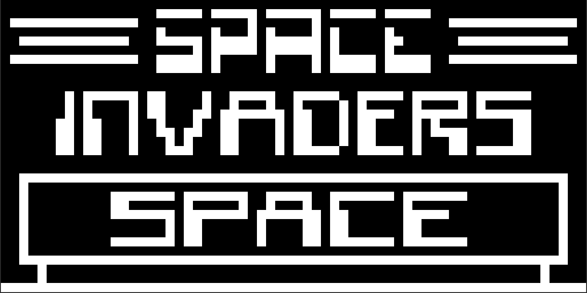

# CHIP-8
CHIP-8 emulator built using C++14 and SDL2



This project builds a small emulator that runs programs (mostly video games) written in the CHIP-8 interpreted programming language initially used on 8-bit microcomputers in the mid-1970s.

## Installation
Requires [SDL2](https://www.libsdl.org/download-2.0.php) for handling audio, input and graphics. Uses CMake for build configuration.

#### Build:
```
git clone https://github.com/esusalla/chip-8
mkdir build && cd build
cmake ..
make
```

#### Run:
```
./chip8 GAME
```

## Public Domain Games
* https://www.zophar.net/pdroms/chip8/chip-8-games-pack.html

## Test ROMs
* https://github.com/corax89/chip8-test-rom
* https://github.com/Skosulor/c8int/tree/master/test
* https://github.com/stianeklund/chip8/blob/master/roms/BC_test.ch8

## References
* https://en.wikipedia.org/wiki/CHIP-8
* http://devernay.free.fr/hacks/chip8/C8TECH10.HTM
* http://mattmik.com/files/chip8/mastering/chip8.html
